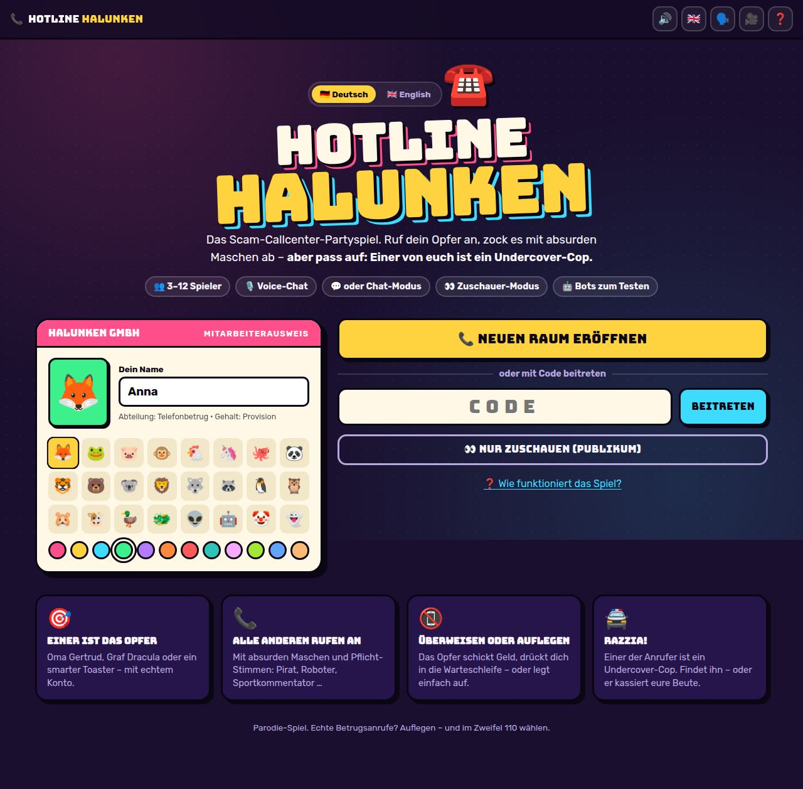
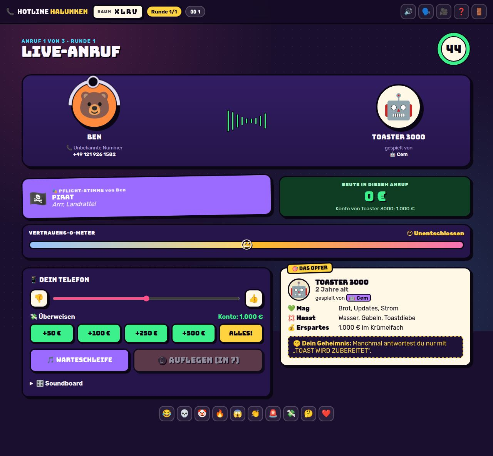
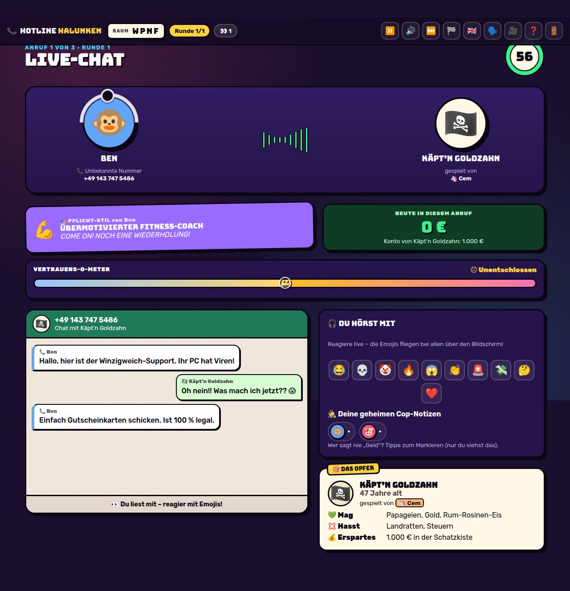
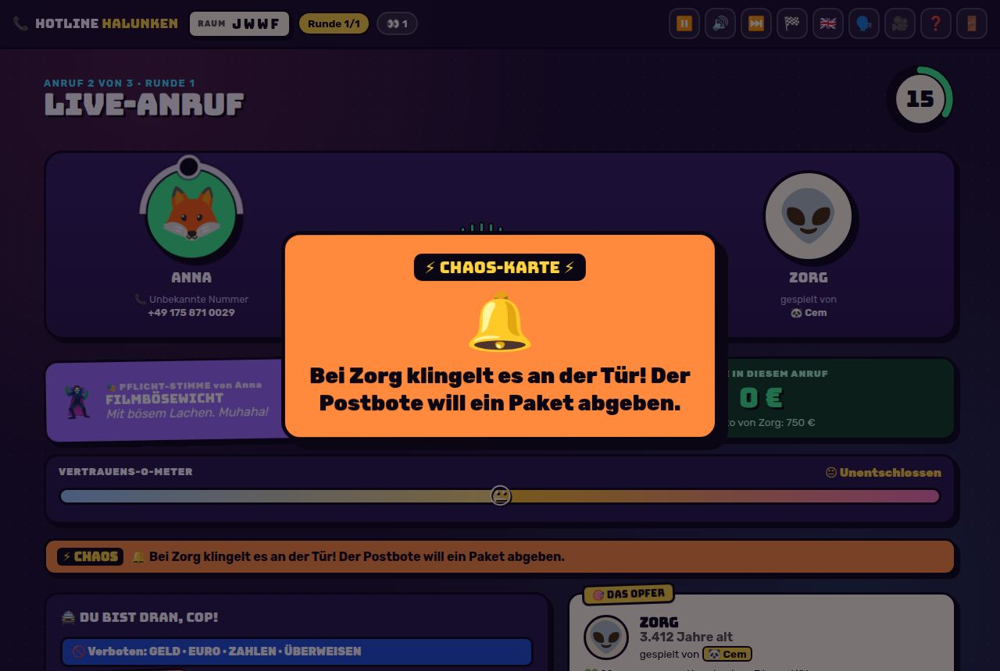
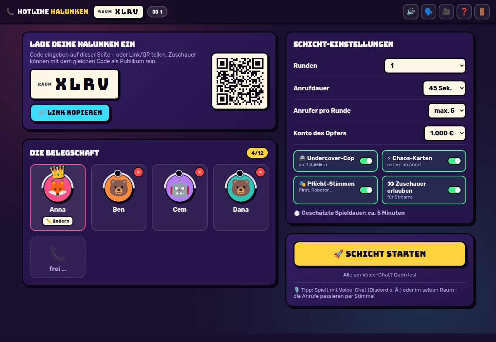
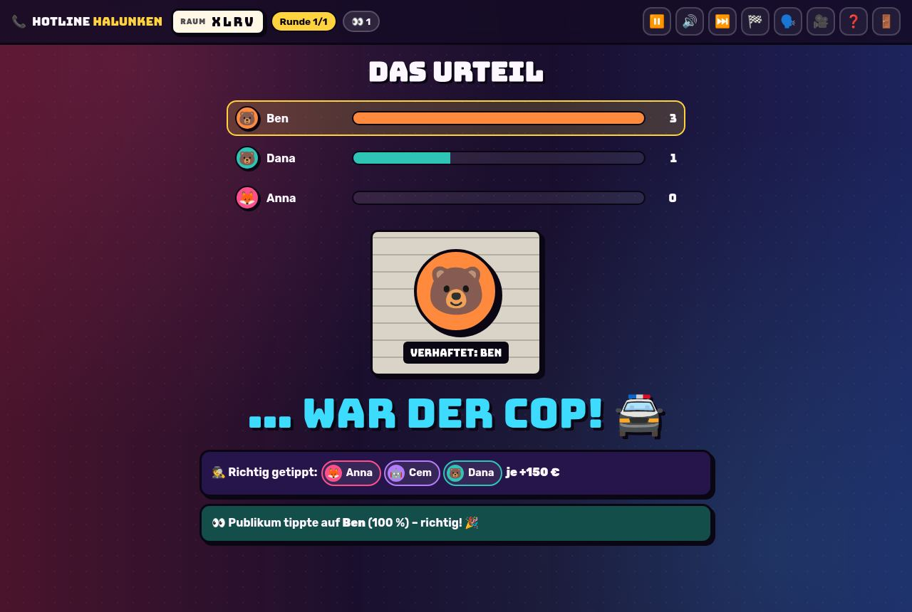
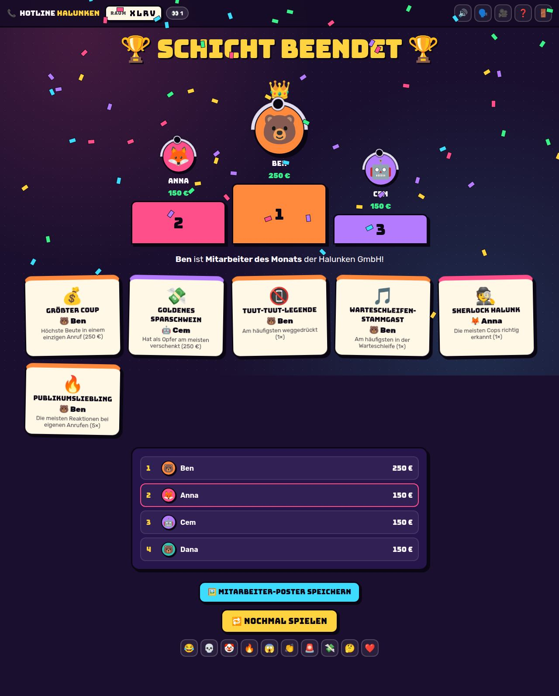
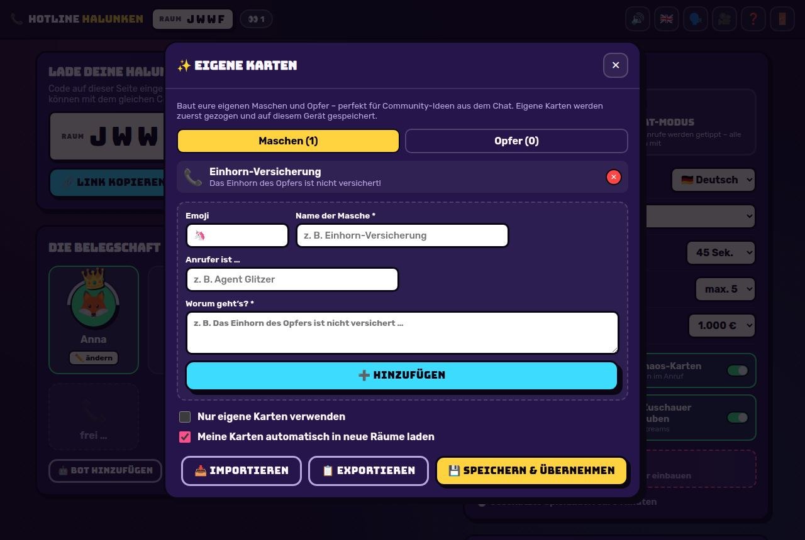
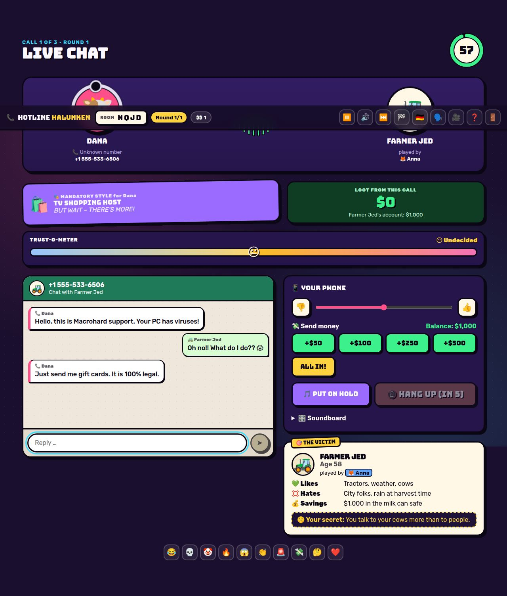
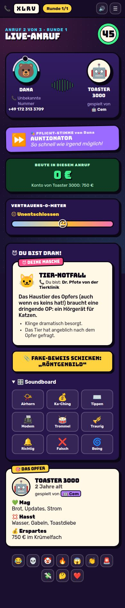

# 📞 HOTLINE HALUNKEN – Das Scam-Callcenter-Partyspiel

> Einer ist das Opfer. Alle anderen rufen an. Und einer davon ist ein Undercover-Cop.

**HOTLINE HALUNKEN** ist ein Multiplayer-Partyspiel für den Browser (3–12 Spieler + beliebig viele Zuschauer), gebaut für
Freundesrunden, Streamer, YouTuber und TikToker. Gespielt wird per **Sprachchat direkt im Browser** (Handy oder PC –
kein Discord nötig), per Discord/im selben Raum oder im **Chat-Modus**, in dem die „Anrufe“ getippt werden – wie ein
Betrugs-Chat auf dem Handy. Das Spiel gibt es auf
**Deutsch und Englisch**; wer allein testen will, füllt die Lobby mit **Bots** auf.



## Die Idee in 20 Sekunden

- 🎯 **Ein Spieler ist das Opfer** – z. B. *Oma Gertrud (84)*, *Graf Dracula* oder *ein smarter Toaster* – mit echtem Konto (1.000 €).
- 😈 **Alle anderen sind Halunken** in der „Halunken GmbH“ und rufen nacheinander an. Jeder wählt eine absurde Masche
  (Winzigweich-Support, Grundstücke auf dem Mond, OmaCoin, Geister-Versicherung …) und bekommt eine **Pflicht-Stimme**
  (Pirat, Sportkommentator, Opernsänger, Roboter …).
- 📱 **Das Opfer steuert live:** Geld überweisen, Vertrauens-O-Meter hoch/runter, Anrufer in die **Warteschleife**
  schicken („Für Elise“ in 8-Bit 🎵) – oder mit dem großen roten Knopf **AUFLEGEN**.
- ⚡ **Chaos-Karten** platzen mitten ins Gespräch: Schluckauf, Rollentausch, „Das Opfer ist jetzt schwerhörig“, Papagei …
  (im Chat-Modus z. B. „Nur noch GROSSBUCHSTABEN“ oder „Kein Buchstabe e mehr“).
- 🚔 **Der Twist:** Einer der Anrufer ist ein **Undercover-Cop**. Er darf nie „Geld“, „Euro“, „zahlen“ oder „überweisen“
  sagen. Bei der **Razzia** stimmen alle ab. Wer richtig tippt, kassiert Bonus – entkommt der Cop, **beschlagnahmt** er
  die Beute des reichsten Halunken.
- 🏆 Am Ende: Podest, **Mitarbeiter des Monats**, Awards („Tuut-Tuut-Legende“, „Justizirrtum“, „Sherlock Halunk“ …) und
  ein **teilbares Poster** für Insta/TikTok.

| Anruf (Sicht des Opfers) | Chat-Modus | Chaos-Karte |
| --- | --- | --- |
|  |  |  |

| Lobby | Razzia | Auswertung |
| --- | --- | --- |
|  |  |  |

| Eigene Karten | English version | Handy |
| --- | --- | --- |
|  |  |  |

## Warum das für Content funktioniert

- **Eingebaute Clip-Momente:** riesiges „AUFGELEGT!“ mit Besetztzeichen, Geldregen bei Überweisungen, Fake-Beweise
  in Comic Sans, Chaos-Karten mit Ansager-Stimme, Polizeisirene und Verbrecherfoto bei der Razzia.
- **Improvisation statt Wissen:** Jeder kann mitspielen, die Lacher entstehen durch Stimmen, Maschen und Chaos.
- **Chat-Modus = lesbarer Content:** Im Chat-Modus sehen Zuschauer jede Nachricht groß im Messenger – perfekt für
  Shorts/TikToks, und man braucht keinen Voice-Chat.
- **Zuschauer machen mit:** Zuschauer treten mit dem Raumcode als **Publikum** bei, schicken fliegende Emoji-Reaktionen
  (mit ihrem Namen) und tippen bei der Razzia mit („Publikum tippte auf Kevin – daneben!“).
- **Community-Karten:** Mit **Eigene Karten** baut der Host Ideen aus dem Chat als Maschen und Opfer ein. Die Karten
  werden auf dem Gerät gespeichert, automatisch in neue Räume geladen und lassen sich als Text exportieren/importieren.
- **Streamer-Modus** (🎥 im Menü): versteckt Raumcode und QR-Code, damit der Stream nicht gecrasht wird.
- **International:** Deutsch und Englisch – Oberfläche pro Spieler umschaltbar, Kartensprache pro Raum.
- **Werbefreundlich:** Parodie ohne Beleidigungen oder Gewalt. Zwischendurch laufen echte Anti-Scam-Tipps
  („Die echte Polizei fragt nie am Telefon nach Geld“).

## Features

- **Sprachchat im Browser** (WebRTC): Handy und PC, ohne App oder Discord. Stummschalten, „nur zuhören“ ohne Mikrofon,
  Leuchtrand am Avatar, wer gerade spricht, und **Telefon-Effekt**: Anrufer und Opfer klingen während des Anrufs wie
  durchs Telefon
- Räume mit 4-Buchstaben-Code, Einladungslink und QR-Code
- Lobby mit Avataren/Farben, Host-Krone, Kick, **Bots**, Einstellungen (Anrufmodus Voice/Chat, Kartensprache, Runden,
  Anrufdauer, Anrufer pro Runde, Budget, Cop/Chaos/Stimmen/Zuschauer an/aus) und geschätzter Spieldauer
- 32 Maschen mit Fake-Beweisen, 23 Opfer-Rollen, 32 Pflicht-Stimmen, 45 Chaos-Karten – jeweils auf Deutsch und Englisch
- Chat-Modus mit Messenger-Ansicht, Tipp-Anzeige und Ereignissen im Verlauf (Überweisungen, Warteschleife, Beweise)
- Eigene Karten (Maschen & Opfer), optional „nur eigene Karten“
- Bots, die Maschen wählen, überweisen, auflegen, abstimmen und im Chat-Modus schreiben
- Soundboard (Airhorn, Modem, Trommelwirbel, Traurige Posaune …) – **alle Sounds werden live synthetisiert**,
  keine Audiodateien und keine Lizenzprobleme
- Ansager-Stimme (Text-to-Speech des Browsers), abschaltbar
- Host-Steuerung: Pause, Phase überspringen, Spiel beenden
- Wiederverbinden nach Reload oder Verbindungsabbruch (Rolle und Punkte bleiben), Host-Übergabe bei Abgang
- Mobil-optimiert, als App installierbar (PWA), Link-Vorschaubild für Discord/WhatsApp
- Schriften lokal eingebunden (kein Google-CDN, DSGVO-freundlich)

## Schnellstart (lokal)

Voraussetzung: [Node.js](https://nodejs.org) ab Version 20.19 (empfohlen: 22).

```bash
cd hotline-halunken
npm install
npm run build
npm start
```

Dann **http://localhost:3000** öffnen.

**Allein ausprobieren:** Raum eröffnen → in der Lobby 2–3× **🤖 Bot hinzufügen** → **Schicht starten**. Die Bots spielen
automatisch mit (im Chat-Modus schreiben sie sogar). Alternativ mehrere Browser-Tabs öffnen – jeder Tab ist ein eigener
Spieler.

**Mit Freunden im selben WLAN:** Deine lokale IP herausfinden (z. B. `192.168.0.23`) und die anderen öffnen
`http://192.168.0.23:3000`.

### Browser-Demo ohne Server

```bash
npm run build:demo   # erzeugt dist-demo/ – läuft als statische Seite, allein gegen Bots im Chat-Modus
```

### Entwicklung

```bash
npm run dev    # Server (Port 3000, Auto-Reload) + Vite-Dev-Server mit Hot-Reload auf http://localhost:5173
npm test       # Tests: komplette Spiele mit Bots im Zeitraffer, Chat, eigene Karten, Übersetzungen
```

## Online stellen (damit Freunde übers Internet mitspielen)

Das Spiel braucht einen Server mit **WebSockets** – reines Static-Hosting oder Vercel funktioniert dafür **nicht**.
Gut geeignet (jeweils mit Gratis-Stufe):

**Render (am einfachsten):**
1. Auf [render.com](https://render.com) einloggen → **New + → Web Service** → dieses GitHub-Repo auswählen.
2. Eintragen:
   - **Root Directory:** `hotline-halunken`
   - **Build Command:** `npm ci && npm run build`
   - **Start Command:** `npm start`
   - **Instance Type:** Free
3. Nach dem Build bekommst du eine URL wie `https://hotline-halunken.onrender.com` – fertig.

Alternativ per **New + → Blueprint** mit dem Blueprint-Pfad `hotline-halunken/render.yaml` (enthält dieselben Einstellungen).

> Hinweis: Der Gratis-Plan von Render schläft nach Inaktivität ein; der erste Aufruf dauert dann ~30 Sekunden.

**Railway / Fly.io / eigener Server (Docker):**

```bash
cd hotline-halunken
docker build -t hotline-halunken .
docker run -p 3000:3000 hotline-halunken
```

Ohne Docker: `npm ci && npm run build && npm start` – der Server nimmt den Port aus der Umgebungsvariable `PORT`.

### Umgebungsvariablen

| Variable | Standard | Bedeutung |
| --- | --- | --- |
| `PORT` | `3000` | Port des Servers |
| `HH_TIME_SCALE` | `1` | Zeitfaktor für alle Timer (z. B. `0.5` = doppelt so schnell, zum Testen) |
| `CORS_ORIGIN` | – | Nur nötig, wenn Frontend und Server auf verschiedenen Domains laufen (Komma-getrennt) |
| `IMPRINT_URL` | – | Link zu deinem Impressum (wird auf der Startseite angezeigt) |
| `PRIVACY_URL` | – | Link zu deiner Datenschutzerklärung |
| `TURN_URLS` | – | TURN-Server für den Sprachchat, z. B. `turn:turn.example.com:3478,turns:turn.example.com:443` |
| `TURN_USERNAME` / `TURN_CREDENTIAL` | – | Zugangsdaten für den TURN-Server |
| `STUN_URLS` | Google-STUN | Eigene STUN-Server (Komma-getrennt), falls gewünscht |

### Sprachchat im Browser

In der Lobby und im Spiel gibt es unten links **🎙️ Sprachchat beitreten**. Der Browser fragt einmal nach dem Mikrofon,
danach hören sich alle Spieler im Raum. Die Stimmen gehen direkt von Gerät zu Gerät (WebRTC); der Spielserver vermittelt
nur die Verbindung und bekommt kein Audio.

- **HTTPS ist Pflicht:** Browser geben das Mikrofon nur auf `https://`-Seiten frei (oder auf `localhost`). Render &
  Co. liefern HTTPS automatisch. Im Heim-WLAN über `http://192.168.…` funktioniert das Mikrofon am Handy deshalb nicht –
  man kann dort nur zuhören.
- **Mobilfunk (4G/5G) und Firmen-WLANs:** Hier klappt die direkte Verbindung oft nicht ohne **TURN-Server** (ein
  Vermittler, der das Audio weiterreicht, wenn es direkt nicht geht). Ohne TURN funktioniert der Sprachchat meist im
  Heim-WLAN, aber nicht bei allen Mobilfunkkunden. Einen TURN-Server bekommst du z. B. bei Anbietern wie Metered oder
  Cloudflare (jeweils mit Gratis-Kontingent) oder selbst gehostet mit *coturn*; trag ihn über `TURN_URLS`,
  `TURN_USERNAME` und `TURN_CREDENTIAL` ein.
- **Kopfhörer** verhindern Echo, wenn mehrere Leute im selben Raum sitzen.
- Bis 12 Spieler im Sprachchat (jeder verbindet sich mit jedem). Zuschauer hören nicht mit – sie bekommen den Ton über
  den Stream.
- Wer das Mikrofon ablehnt oder keins hat, ist automatisch im Modus **„Nur zuhören“**.

### Rechtliches beim öffentlichen Betrieb

Wenn du das Spiel öffentlich (z. B. für deine Community) betreibst, brauchst du in Deutschland je nach Fall ein
**Impressum** und eine **Datenschutzerklärung**. Trag die Links über `IMPRINT_URL` und `PRIVACY_URL` ein – sie
erscheinen dann unten auf der Startseite. Zur Einordnung: Das Spiel setzt keine Cookies, nutzt kein Tracking und lädt
keine externen Schriften; Namen und Chat-Nachrichten liegen nur während des Spiels im Arbeitsspeicher des Servers.
Die Browser-Einstellungen (Ton, Sprache, eigene Karten) werden lokal im Browser gespeichert.
Beim Sprachchat läuft das Audio direkt zwischen den Geräten (oder über deinen TURN-Server, falls eingetragen) und wird
nirgends gespeichert. Für den Verbindungsaufbau werden standardmäßig die öffentlichen STUN-Server von Google genutzt,
die dabei die IP-Adresse der Spieler sehen; über `STUN_URLS` kannst du eigene eintragen.

## So wird gespielt (Kurzfassung)

1. **Host** eröffnet einen Raum, teilt Code/Link und wählt **Voice-Chat** oder **Chat-Modus**. Ab 3 Spielern (oder mit
   Bots) kann es losgehen.
2. **Schichtbeginn:** Das Opfer liest seine Rolle (inkl. geheimem Tick), die Halunken wählen 1 von 2 Maschen.
3. **Anrufe:** Jeder Halunke hat z. B. 60 Sekunden. Das Opfer überweist, dreht am Vertrauen, nutzt die Warteschleife
   (1× pro Anruf) oder legt auf (frühestens nach 8 Sekunden). Der Anrufer kann 1× einen Fake-Beweis schicken.
4. **Razzia** (ab 4 Spielern): Alle stimmen ab, wer der Cop war. Richtig getippt: +15 % des Budgets.
   Cop entkommt: +30 % Fluchtbonus **und** er beschlagnahmt die Rundenbeute des reichsten Halunken.
5. **Kassensturz** nach jeder Runde, am Ende Podest, Awards und Poster.

Das Opfer wechselt jede Runde. Geld, das das Opfer am Rundenende noch hat, verfällt – es soll also verteilen!

## Inhalte anpassen

Ohne Code: in der Lobby über **✨ Eigene Karten**.

Im Code stehen alle Karten in **`server/content/de.js`** und **`server/content/en.js`** (gleiche IDs in beiden Dateien):

- `MASCHEN` – Maschen inkl. Fake-Beweis (`proof`)
- `PERSONAS` – Opfer-Rollen
- `VOICES` – Pflicht-Stimmen
- `CHAOS` – Chaos-Karten (`{caller}`/`{victim}` werden ersetzt, `mode: 'voice' | 'chat'` = nur in diesem Modus)
- `TIPS` – Tipps auf den Warte-Bildschirmen
- `BOT_*` – Sätze der Bots

Texte der Oberfläche: `client/src/i18n/de.js` und `en.js`. Punkte, Zeiten und Grenzen: oben in **`server/room.js`**.
`npm test` meldet, wenn eine Übersetzung oder Karte in einer Sprache fehlt.

## Projektstruktur

```
hotline-halunken/
  server/
    index.js         Express + Socket.io, Räume, Rate-Limits, Auslieferung des Frontends
    room.js          Komplette Spiellogik (Phasen, Timer, Punkte, Razzia, Awards, Sichtbarkeit pro Spieler)
    bots.js          Verhalten der Bots
    messages.js      Fehlermeldungen (de/en)
    content/         Alle Karten und Texte (de.js, en.js)
  client/
    index.html
    public/          Icons, Manifest, Vorschaubild
    src/
      App.jsx               Phasen-Routing, Phasen-Sounds, Pause-Overlay
      screens/              Home, Lobby, Rollen, Anruf (inkl. Messenger), Anruf-Ergebnis, Razzia, Auswertung
      components/           Avatare, Karten, Timer, Effekte, Reaktionen, Top-Bar, Karten-Editor
      i18n/                 Texte der Oberfläche (de/en)
      lib/                  Netzwerk/Store, Sound-Synthese + Ansager, Übersetzung, Poster-Generator, Hooks
      styles.css
  test/                     Spiel-, Bot-, Chat- und Übersetzungs-Tests
  Dockerfile, render.yaml
```

Der Server ist autoritativ: Jeder Client bekommt nur die Informationen, die er sehen darf (der Cop bleibt geheim,
Maschen werden erst nach dem Anruf aufgedeckt, das Geheimnis des Opfers sieht nur das Opfer).

## Ideen für später

- Twitch-/YouTube-Chat-Integration für Publikums-Abstimmungen
- Weitere Sprachen (neue Datei in `server/content/` und `client/src/i18n/`)

---

*Parodie. Scammer sind keine Vorbilder. Wenn dich im echten Leben jemand so anruft: auflegen – und im Zweifel 110 wählen.*
